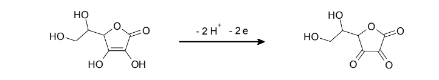

### Introduction:
Cyclic voltammetry is a valuable tool for studying electrode reaction mechanisms and reversibility. It strongly depends on the magnitude of the correlation between the electron transfer rate and the mass transfer rate of
diffusion. Electrochemical reversibility is classified as reversible, quasi-reversible, and irreversible cyclic voltammetry. It is the charge transfer by mass transfer ratio dependent on the scan rate. If a redox system 
remains in equilibrium throughout the potential scan, the redox process is said to be reversible. The following parameter values are used to characterize the CV of a reversible process:
 
	1.	The peak potential separation DEp (= Epc - Epa) = 59.2/n mV, at all scan rates at 250C.
	2.	The peak current ratio = ipa/ipc = 1 at all scan rates.
    3.  The peak current function, ip/n1/2 (n = scan rate)  is independent of the scan rate.
	 
Electrochemical reversibility describes the rate of electron transfer. If the electron transfer rate is slow, extreme electrode potentials are needed to drive the electron transfer and register current on the potentiostat,
which is known as an irreversible electron transfer. Ascorbic acid is used as an example of a substance showing irreversible behavior. This experiment reviews the reversibility of electrode reactions with the help of ascorbic
acid, which is also known as vitamin C. It has antioxidant properties and can be found in many foodstuffs. Vitamin C can be easily oxidized to dehydroascorbic acid on a carbon electrode.
 

 

This reaction can be used to determine the concentration of vitamin C in samples, apart from its kinetic studies. Vitamin C is often determined by titration, however, voltammetry is more selective since other oxidizing or 
reducing substances do not interfere. Hence, preference is given to the determination that is conducted by cyclic voltammetry.
				